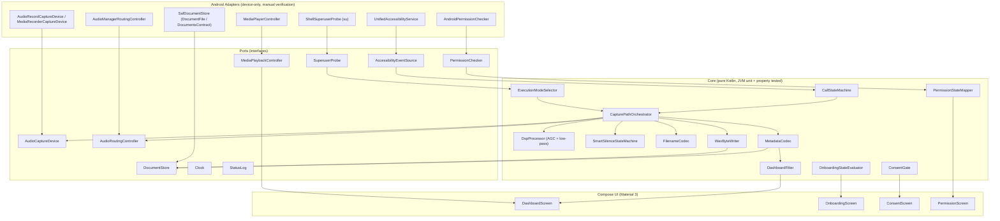
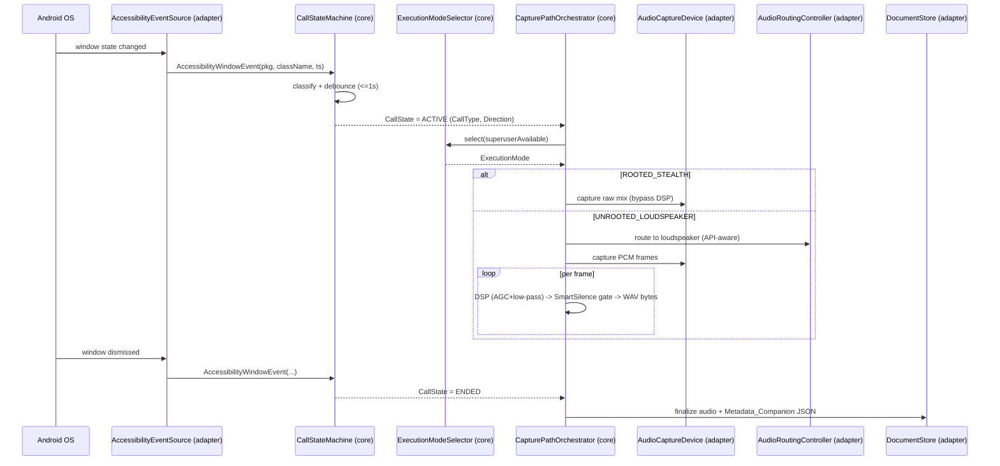

# Design Document

## Overview

The Unified Call Recorder is a single, sideloaded Android APK (Kotlin, Jetpack Compose + Material 3, minSdk 29, targetSdk 35, compileSdk 36) that automatically captures cellular and WhatsApp VoIP call audio using an internal `AccessibilityService`. It selects a capture strategy per call (rooted stealth vs. unrooted loudspeaker), applies a real-time DSP pipeline and Smart Silence optimization on the unrooted PCM path, and persists every recording plus a companion JSON metadata file into a user-selected public directory bound through the Storage Access Framework (SAF).

The dominant design driver is **testability**. Android call-recording behavior cannot be exercised on an emulator or in CI, so the design pushes every deterministic decision into plain-Kotlin, framework-independent units that run on the JVM. All Android framework touch points (accessibility events, audio capture, audio routing, SAF document I/O, media playback, superuser probing, clock, permission queries) are hidden behind narrow interfaces (ports). The core logic depends only on these ports and on plain data types, so it can be unit-tested and property-tested on the JVM without a device. The thin Android adapters that implement the ports are validated through clearly marked device-only manual verification steps.

This design follows a hexagonal (ports-and-adapters) architecture:

- **Core (pure Kotlin, JVM-testable):** filename codec, metadata codec, Smart Silence state machine, DSP math, dashboard filter/search predicates, permission-state mapper, execution-mode selector, call-state machine, capture-path orchestration policy, WAV byte-layout writer.
- **Ports (interfaces):** abstractions over every Android/OS capability the core needs.
- **Adapters (Android-only, manually verified):** concrete implementations using `AccessibilityService`, `AudioRecord`/`MediaRecorder`, `AudioManager`, `DocumentFile`/`DocumentsContract`, `MediaPlayer`, and a `Runtime.exec("su")` probe.
- **UI (Compose):** stateless composables driven by view-state produced by the core.

### Research Notes and Key Findings

The following findings from the requirements and platform behavior inform the design. Sources are Android platform documentation behaviors well established for the targeted API range.

- **Communication device routing changed at API 31.** `AudioManager.setSpeakerphoneOn` is deprecated from Android 12 (API 31). For API 31–35 the design uses `AudioManager.getAvailableCommunicationDevices()` + `setCommunicationDevice(...)` selecting `TYPE_BUILTIN_SPEAKER`; for API ≤ 30 it uses `isSpeakerphoneOn = true`. This split is captured in the `AudioRoutingController` port and its API-level adapter selection (Requirement 3.3). Reference: [AudioManager.setCommunicationDevice](https://developer.android.com/reference/android/media/AudioManager#setCommunicationDevice(android.media.AudioDeviceInfo)).
- **`AudioSource.VOICE_CALL` is not reliably accessible to third-party apps.** The unrooted path therefore uses `AudioSource.VOICE_COMMUNICATION` plus loudspeaker routing to physically capture the far party through the mic (Requirement 3.3). Reference: [MediaRecorder.AudioSource](https://developer.android.com/reference/android/media/MediaRecorder.AudioSource).
- **DSP/Smart Silence require a raw sample stream.** `MediaRecorder` emits an encoded file and does not expose PCM frames, so when DSP or Smart Silence is active the design captures via `AudioRecord` (PCM 16-bit) and writes WAV itself (Requirement 6.3). The rooted stealth path and the plain unrooted path with no processing may use the configured encoder (AAC default).
- **SAF persistence.** Public-folder persistence uses `ACTION_OPEN_DOCUMENT_TREE`, `contentResolver.takePersistableUriPermission`, and `DocumentFile`/`DocumentsContract` so files survive uninstall and rebind on reinstall (Requirements 6, 9). Reference: [Open files using SAF](https://developer.android.com/training/data-storage/shared/documents-files).
- **Accessibility state model.** WhatsApp VoIP (`com.whatsapp` → `VoipActivity`) and dialer in-call windows (`InCallActivity`/`InCallUI`) drive call-state transitions; non-target packages are ignored; duplicate matching events inside 1 second are debounced (Requirement 1).
- **Property-based testing on the JVM.** Kotlin has two mature PBT libraries: [kotest property testing](https://kotest.io/docs/proptest/property-based-testing.html) and [jqwik](https://jqwik.net/). The design targets **kotest property testing** running on the JVM source set (`src/test`), which keeps property tests device-independent. Content rephrased for compliance with licensing restrictions.

## Architecture



### Layering rules

1. Core modules never import `android.*`. They depend only on Kotlin stdlib, ports, and plain data types. This is the invariant that makes JVM property testing possible.
2. Ports are pure interfaces expressed in terms of plain data (byte arrays, `ShortArray`, strings, data classes), never Android types.
3. Adapters are the only place `android.*` appears and are excluded from JVM property tests; they are validated by the device-only manual checklist.
4. The UI layer renders immutable view-state produced by the core and forwards user intents back to the core.

### Module layout (Gradle Kotlin DSL)

```
:app                      // Android application module (adapters + Compose UI + manifest)
:core                     // pure Kotlin (JVM) library module: all deterministic logic + ports
```

`:core` is a plain Kotlin/JVM module so its unit and property tests run without the Android toolchain. `:app` depends on `:core` and provides the adapters. `compileSdk = 36`, `minSdk = 29`, `targetSdk = 35`, JDK 21 (Android Studio JBR), Gradle via wrapper.

### End-to-end call flow



## Components and Interfaces

### Ports (interfaces over Android/OS)

All ports use plain data types. Suspending functions denote background (`Dispatchers.IO`) work; the core never assumes a particular thread but the adapters honor the coroutine dispatcher contracts in the requirements.

```kotlin
// Accessibility (Requirement 1)
data class AccessibilityWindowEvent(
    val packageName: String,
    val className: String,
    val timestampMillis: Long,
    val windowDismissed: Boolean
)

interface AccessibilityEventSource {
    /** Emits raw window events; adapter does no filtering beyond what the platform provides. */
    fun events(): kotlinx.coroutines.flow.Flow<AccessibilityWindowEvent>
    val enabled: Boolean
}

// Superuser probe (Requirement 3.1/3.2)
interface SuperuserProbe {
    /** Returns true if an `su` shell is available. Adapter runs off the main thread. */
    suspend fun isSuperuserAvailable(): Boolean
}

// Audio capture (Requirement 2, 3, 6.3)
interface AudioCaptureDevice {
    /** Streams raw PCM 16-bit frames for the AudioRecord path (DSP/Smart Silence active). */
    fun pcmFrames(config: CaptureConfig): kotlinx.coroutines.flow.Flow<ShortArray>
    /** Encoded capture (MediaRecorder / rooted) writing to a sink; returns final byte length. */
    suspend fun captureEncoded(config: CaptureConfig, sink: ByteSink): Long
    suspend fun stop()
}

// Audio routing (Requirement 3.3/3.4)
interface AudioRoutingController {
    val apiLevel: Int
    /** Route call audio to the built-in loudspeaker using the API-appropriate mechanism. */
    suspend fun routeToLoudspeaker(): RoutingResult
    suspend fun restorePreviousRouting()
}

// Storage via SAF (Requirements 6, 9)
interface DocumentStore {
    suspend fun isBound(): Boolean
    suspend fun bind(treeUri: String): Boolean            // takePersistableUriPermission
    suspend fun listRecordings(): List<StoredDocument>
    suspend fun freeBytes(): Long
    suspend fun createDocument(name: String, mime: String): ByteSink
    suspend fun readText(name: String): String?
    suspend fun writeText(name: String, content: String)
    suspend fun existingNames(): Set<String>
}

interface ByteSink {
    suspend fun write(bytes: ByteArray, offset: Int, length: Int)
    suspend fun close()
    suspend fun abort()
}

// Playback (Requirement 7)
interface MediaPlaybackController {
    suspend fun play(name: String): PlaybackResult
    fun pause(); fun resume(); fun stop()
    val positionMillis: Long
}

// Cross-cutting
interface Clock { fun nowMillis(): Long }
interface PermissionChecker { fun status(p: RuntimePermission): Boolean; fun shouldOpenSettings(p: RuntimePermission): Boolean }
interface StatusLog { fun record(entry: StatusEntry) }
```

### Core components (pure Kotlin)

| Component | Responsibility | Key requirement(s) |
|---|---|---|
| `CallStateMachine` | Classify window events into `CallState`, apply target-package filter and 1s duplicate debounce | 1.1–1.5, 1.8 |
| `ExecutionModeSelector` | Map superuser availability to `ExecutionMode` | 3.1, 3.2, 3.3 |
| `CapturePathOrchestrator` | Drive capture lifecycle, ordered fallback path attempts, silence-detection failover, status logging | 2.x, 3.4–3.8 |
| `DspProcessor` | AGC gain computation + clamp + single-pole low-pass over PCM frames | 4.1, 4.3, 4.4 |
| `SmartSilenceStateMachine` | Amplitude/frame-count gate that pauses/resumes serialization, counts skipped seconds | 5.1–5.4 |
| `FilenameCodec` | Encode/parse `[CALL_TYPE]_[DIRECTION]_[YYYYMMDD]_[HHMMSS]`, collision suffixing | 6.2, 7.5 |
| `MetadataCodec` | Serialize/deserialize `Metadata_Companion` JSON, UNKNOWN fallback | 6.9, 6.10, 7.4 |
| `WavByteWriter` | Produce a valid WAV header + PCM payload deterministically | 6.3 |
| `DashboardFilter` | Filter/search predicate over recordings by Call_Type/Direction/text, sorted newest-first | 7.1–7.3, 7.9 |
| `PermissionStateMapper` | Map raw permission booleans + API level to required-permission set and display states | 8.1, 8.3–8.5 |
| `ExecutionMode`/format policy | Choose encoder format (WAV when DSP/Silence active; else configured/AAC) with fallback ordering | 6.3, 6.4 |
| `OnboardingStateEvaluator` | Compute onboarding completion from (accessibility enabled, directory bound) | 9.1, 9.8 |
| `ConsentGate` | Gate automatic recording on persisted acknowledgment | 10.2, 10.5, 10.6 |

### UI components (Compose, Material 3)

- `ConsentScreen`: shows `Consent_Notice`, acknowledge/dismiss actions (Req 10).
- `OnboardingScreen`: mandatory directory picker launcher, accessibility + restricted-settings guidance, settings deep links (Req 9).
- `PermissionScreen`: renders each required permission's granted/not-granted state from `PermissionStateMapper` (Req 8).
- `DashboardScreen`: recording list, Call_Type/Direction filters, search field, playback transport, bookmark/annotation overlay, empty state (Req 7).

## Data Models

```kotlin
enum class CallType { CELLULAR, WHATSAPP }
enum class Direction { INCOMING, OUTGOING }
enum class CallState { INCOMING, OUTGOING, ACTIVE, ENDED }
enum class ExecutionMode { ROOTED_STEALTH, UNROOTED_LOUDSPEAKER }
enum class AudioFormat { WAV, MP4, AAC }
enum class RuntimePermission { RECORD_AUDIO, READ_PHONE_STATE, MODIFY_AUDIO_SETTINGS, POST_NOTIFICATIONS }
enum class PermissionDisplay { GRANTED, NOT_GRANTED }

data class IdentityContext(
    val phoneNumber: String = "UNKNOWN",
    val contactName: String = "UNKNOWN"
)

data class AudioProfile(
    val executionMode: ExecutionMode,
    val dspFilterId: String? = null,        // present only for UNROOTED_LOUDSPEAKER (Req 4.4)
    val skippedSilentSeconds: Int = 0        // Req 5.4
)

data class Bookmark(val timestampMillis: Long, val text: String)
data class UserAnnotations(
    val bookmarks: List<Bookmark> = emptyList(),
    val categoryTags: List<String> = emptyList()
)

data class MetadataCompanion(
    val fileVersion: String = "1.0",
    val callType: CallType,
    val direction: Direction,
    val identity: IdentityContext,
    val timestampStartMillis: Long,
    val durationSeconds: Long,
    val fileExtension: String,
    val audioProfile: AudioProfile,
    val userAnnotations: UserAnnotations = UserAnnotations()
)

// Parsed representation of a filename per [CALL_TYPE]_[DIRECTION]_[YYYYMMDD]_[HHMMSS]
data class ParsedFilename(
    val callType: CallType,
    val direction: Direction,
    val year: Int, val month: Int, val day: Int,
    val hour: Int, val minute: Int, val second: Int,
    val collisionSuffix: Int? = null
)

data class RecordingEntry(
    val fileName: String,
    val parsed: ParsedFilename?,             // null if name is non-conforming
    val metadata: MetadataCompanion?         // null if missing/unparseable (Req 7.5)
)

data class DashboardFilterState(
    val callTypeFilter: CallTypeFilter = CallTypeFilter.ALL,
    val directionFilter: DirectionFilter = DirectionFilter.ALL,
    val searchText: String = ""
)
enum class CallTypeFilter { ALL, WHATSAPP, CELLULAR }
enum class DirectionFilter { ALL, INCOMING, OUTGOING }

data class CaptureConfig(
    val executionMode: ExecutionMode,
    val format: AudioFormat,
    val sampleRate: Int = 44_100,
    val silenceThreshold: Int = 1_500       // amplitude baseline (Req 5)
)

sealed interface StatusEntry {
    val timestampMillis: Long
    data class CaptureStarted(override val timestampMillis: Long, val mode: ExecutionMode) : StatusEntry
    data class CaptureStopped(override val timestampMillis: Long, val abnormal: Boolean) : StatusEntry
    data class PermissionMissing(override val timestampMillis: Long, val permission: RuntimePermission) : StatusEntry
    data class PathAttempt(override val timestampMillis: Long, val attempt: Int, val success: Boolean) : StatusEntry
    data class PathSucceeded(override val timestampMillis: Long) : StatusEntry
    data class CaptureUnestablished(override val timestampMillis: Long) : StatusEntry
    data class FormatFallback(override val timestampMillis: Long, val from: AudioFormat, val to: AudioFormat) : StatusEntry
    data class StorageFailure(override val timestampMillis: Long, val reason: String) : StatusEntry
    data class MetadataWriteFailure(override val timestampMillis: Long) : StatusEntry
}
```

### JSON schema for `Metadata_Companion`

```json
{
  "file_version": "1.0",
  "call_type": "WHATSAPP",
  "direction": "INCOMING",
  "identity": { "phone_number": "+919876543210", "contact_name": "UNKNOWN" },
  "timestamp_start": 1784291400000,
  "duration_seconds": 142,
  "file_extension": "wav",
  "audio_profile": { "execution_mode": "UNROOTED_LOUDSPEAKER", "dsp_filter_id": "agc_lowpass_v1", "skipped_silent_seconds": 12 },
  "user_annotations": { "bookmarks": [ { "timestamp_ms": 30000, "text": "quote" } ], "category_tags": ["work"] }
}
```

The companion file shares the audio file's base name with a `.json` extension and lives adjacent to it in the `Target_Directory` (Req 6.9). Unresolved `direction`/`identity` fields are written as `UNKNOWN` rather than omitted (Req 6.10).

### Filename grammar

```
name        := CALL_TYPE "_" DIRECTION "_" DATE "_" TIME [ "_" SUFFIX ] "." EXT
CALL_TYPE   := "CELLULAR" | "WHATSAPP"
DIRECTION   := "INCOMING" | "OUTGOING"
DATE        := YYYYMMDD   (8 digits)
TIME        := HHMMSS     (6 digits)
SUFFIX      := positive integer, added only on collision (Req 6.2)
EXT         := "wav" | "mp4" | "aac"
```

## Correctness Properties

*A property is a characteristic or behavior that should hold true across all valid executions of a system — essentially, a formal statement about what the system should do. Properties serve as the bridge between human-readable specifications and machine-verifiable correctness guarantees.*

These properties target the pure, framework-independent core modules and are implemented as property-based tests on the JVM (kotest property testing). Acceptance criteria that concern device/OS behavior, threading, UI structure, timing latencies, or one-time configuration are validated by integration/smoke tests and the device-only manual checklist in the Testing Strategy, not by properties.

### Property 1: Target window events classify to the correct call state

*For any* window event whose package is a Target_Dialer with a class name containing `InCallActivity` or `InCallUI`, or the Target_VoIP_App `com.whatsapp` with a class name containing `VoipActivity`, the `CallStateMachine` SHALL produce `ACTIVE`; and *for any* dismissal event from those same target windows while a call is active, it SHALL produce `ENDED`.

**Validates: Requirements 1.2, 1.3, 1.4**

### Property 2: Non-target events never change call state

*For any* prior `CallState` and *any* window event whose package is not one of the Target_Package packages, the resulting `CallState` SHALL equal the prior `CallState`.

**Validates: Requirements 1.5**

### Property 3: Duplicate matching transitions within one second are debounced

*For any* timeline of window events, if a window event matching an already-applied transition arrives within 1 second of the prior matching event, the `CallStateMachine` SHALL retain the current state; transitions separated by more than 1 second SHALL be applied.

**Validates: Requirements 1.8**

### Property 4: Capture-begin guard

*For any* combination of (`CallState`, RECORD_AUDIO grant status, capture-in-progress flag), the orchestrator SHALL begin a new capture if and only if the state is `ACTIVE` AND RECORD_AUDIO is granted AND no capture is in progress; when `ACTIVE` with capture already in progress it SHALL continue the existing capture without starting a new one; when `ACTIVE` without the grant it SHALL skip capture and log a `PermissionMissing` status.

**Validates: Requirements 2.1, 2.4, 2.7**

### Property 5: Abnormal finalize preserves the captured portion

*For any* capture with successfully captured audio where finalize fails, the orchestrator SHALL retain the captured portion as a playable file and log a `CaptureStopped(abnormal=true)` status rather than discarding it.

**Validates: Requirements 2.3**

### Property 6: Capture-begin/continue failure discards the partial

*For any* capture that fails to begin or continue (no usable audio), the orchestrator SHALL stop the attempt, discard the partial recording, and log a capture-failure status.

**Validates: Requirements 2.6**

### Property 7: Finalized WAV duration equals captured length

*For any* PCM stream of N frames at sample rate R written by `WavByteWriter`, the reported duration SHALL equal N / R seconds and the header's data length SHALL equal the PCM payload byte count.

**Validates: Requirements 2.2**

### Property 8: Execution mode selection

*For any* superuser-availability value, `ExecutionModeSelector` SHALL select `ROOTED_STEALTH` when superuser is available and `UNROOTED_LOUDSPEAKER` otherwise.

**Validates: Requirements 3.1, 3.2, 3.3**

### Property 9: API-level routing mechanism selection

*For any* API level in the supported range, the routing-mechanism choice SHALL be speakerphone toggle (`isSpeakerphoneOn`) for API level 30 or lower and communication-device selection (`getAvailableCommunicationDevices` + `setCommunicationDevice`) for API level 31 and higher.

**Validates: Requirements 3.3**

### Property 10: Fallback retry is bounded and fully logged

*For any* sequence of fallback-attempt outcomes, the orchestrator SHALL make at most 3 attempts, emit exactly one `PathAttempt` status entry per attempt, and stop attempting on the first success.

**Validates: Requirements 3.4**

### Property 11: Continuous silence triggers path failover

*For any* amplitude-over-time series produced by a configured capture path, the path SHALL be treated as failed and failover to the next path SHALL be triggered if and only if the stream is continuously silent for at least 3 seconds.

**Validates: Requirements 3.5**

### Property 12: Audible stream logs path success exactly once

*For any* capture path that produces an audible stream, the orchestrator SHALL log exactly one `PathSucceeded` status entry upon first detection of audible audio.

**Validates: Requirements 3.6**

### Property 13: Exhausted paths log capture-unestablished with append-only status history

*For any* run in which all capture paths fail within the 6-second budget, the orchestrator SHALL append a `CaptureUnestablished` status entry and SHALL retain every prior status entry (the status log is append-only and never truncated).

**Validates: Requirements 3.7**

### Property 14: Audio profile records the execution mode and DSP filter consistently

*For any* completed call, the `audio_profile.execution_mode` in the `Metadata_Companion` SHALL equal the selected `ExecutionMode`, and `dsp_filter_id` SHALL be present if and only if the mode is `UNROOTED_LOUDSPEAKER` (DSP applied) and absent for `ROOTED_STEALTH`.

**Validates: Requirements 3.8, 4.4**

### Property 15: DSP output stays in bounds and normalizes level

*For any* PCM frame, `DspProcessor` output samples SHALL remain within the 16-bit range [-32768, 32767] (clamped), the AGC-applied level SHALL move toward the configured target level (not away from it), and the low-pass stage SHALL not increase high-frequency energy relative to the input.

**Validates: Requirements 4.1**

### Property 16: Rooted stealth bypasses DSP (identity)

*For any* captured stream when the `ExecutionMode` is `ROOTED_STEALTH`, the bytes written to storage SHALL be identical to the raw captured bytes (no DSP transformation applied).

**Validates: Requirements 4.3**

### Property 17: Smart Silence pauses only after more than five continuous seconds below threshold

*For any* amplitude-over-time series, `SmartSilenceStateMachine` SHALL pause serialization if and only if the average amplitude remains strictly below `Silence_Threshold` for a continuous period exceeding 5.0 seconds, and SHALL resume writing once the amplitude rises to or above the threshold.

**Validates: Requirements 5.2, 5.3**

### Property 18: WAV output remains structurally valid across arbitrary pause/resume sequences

*For any* sequence of pause and resume operations driven by Smart Silence, the resulting WAV bytes SHALL remain valid: the data-chunk length SHALL be a whole multiple of the frame size and SHALL equal the number of bytes actually written, so the file is never corrupted by pausing/resuming.

**Validates: Requirements 5.3**

### Property 19: Skipped-silence accounting is exact

*For any* amplitude-over-time series, the `skipped_silent_seconds` recorded in `audio_profile` SHALL equal the total duration of intervals during which serialization was paused.

**Validates: Requirements 5.4**

### Property 20: Filename round-trip and uniqueness

*For any* (`CallType`, `Direction`, timestamp), `FilenameCodec.parse(encode(x))` SHALL yield an equivalent value; and *for any* set of existing names, the encoder SHALL produce a name that is not already present in the set (applying a distinguishing suffix on collision).

**Validates: Requirements 6.2, 7.5**

### Property 21: Audio format selection policy

*For any* (DSP-active, Smart-Silence-active, configured-format) input, the selected format SHALL be `WAV` when either DSP or Smart Silence is active; otherwise it SHALL be the Application-configured format, defaulting to `AAC` when none is configured.

**Validates: Requirements 6.3**

### Property 22: Format fallback selects a distinct supported format

*For any* set of failing formats that does not include all of {WAV, MP4, AAC}, the fallback SHALL select a supported format different from every failed format and SHALL log a `FormatFallback` status entry.

**Validates: Requirements 6.4**

### Property 23: Storage-write failure is non-destructive

*For any* store containing previously saved recordings, when a write to the `Target_Directory` fails the orchestrator SHALL log a `StorageFailure`, retain any successfully written portion, and SHALL NOT delete any previously saved recording.

**Validates: Requirements 6.6**

### Property 24: Storage-unavailable abort guard preserves in-memory data

*For any* required recording size and available free bytes, when the `Target_Directory` is unavailable or free space is insufficient at the moment writing begins, the orchestrator SHALL abort the write before writing, log a storage-unavailable status, and preserve the in-memory recording data.

**Validates: Requirements 6.7**

### Property 25: Storage access is confined to the bound directory

*For any* store contents, the set of recordings surfaced by listing/scanning SHALL contain only documents located under the bound `Target_Directory` tree and SHALL never include audio content from outside that tree.

**Validates: Requirements 6.8**

### Property 26: Metadata round-trip and companion adjacency

*For any* valid `MetadataCompanion`, `MetadataCodec.decode(encode(m))` SHALL yield an equivalent value, and the companion file name SHALL equal the audio file's base name with a `.json` extension.

**Validates: Requirements 6.9**

### Property 27: Unresolved metadata fields fall back to UNKNOWN and the file is always written

*For any* metadata in which `Direction` or any `Identity_Context` field cannot be resolved, the serialized `Metadata_Companion` SHALL contain the literal `UNKNOWN` for each unresolved field and a companion file SHALL always be produced (never omitted).

**Validates: Requirements 6.10**

### Property 28: Metadata-write failure retains the audio recording

*For any* run in which writing the `Metadata_Companion` fails, the orchestrator SHALL log a `MetadataWriteFailure` status and SHALL retain the associated audio recording in the `Target_Directory`.

**Validates: Requirements 6.11**

### Property 29: Dashboard ordering and source isolation

*For any* list of recording entries, `DashboardFilter` output SHALL be ordered by recording timestamp from most recent to oldest and SHALL include only entries drawn from the `Target_Directory`.

**Validates: Requirements 7.1**

### Property 30: Filter and search predicate soundness and completeness (including empty state)

*For any* list of recording entries and *any* `DashboardFilterState`, every entry in the result SHALL satisfy all active criteria (Call_Type, Direction, and text matched against contact name or phone number, using `Metadata_Companion` fields when present else filename-derived fields), every excluded entry SHALL fail at least one active criterion, and when the result is empty the view-state SHALL be the empty state.

**Validates: Requirements 7.3, 7.9**

### Property 31: Duration formatting round-trips as MM:SS

*For any* non-negative duration under one hour, formatting to `MM:SS` SHALL produce zero-padded minutes and seconds that parse back to the original number of seconds.

**Validates: Requirements 7.4**

### Property 32: Missing metadata renders from filename with placeholders and is never hidden

*For any* recording entry whose `Metadata_Companion` is absent or unparseable but whose file name conforms to the naming grammar, the rendered view-model SHALL derive its fields from the parsed file name, use a placeholder for each unavailable metadata field, and retain the entry in the list.

**Validates: Requirements 7.5**

### Property 33: Playback state transitions

*For any* sequence of play/pause/resume/stop operations, the modeled playback position SHALL resume from the paused position after resume and SHALL reset to the start (position 0) after stop.

**Validates: Requirements 7.7**

### Property 34: Annotation edits round-trip through the companion

*For any* sequence of bookmark/category-tag create or edit operations applied to a `MetadataCompanion`, serializing and then deserializing the `user_annotations` SHALL reflect exactly the applied edits.

**Validates: Requirements 7.8**

### Property 35: Playback failure surfaces an error and retains the entry

*For any* playback attempt that cannot start or fails before completion, the view-state SHALL become an error state and the recording SHALL remain present in the list.

**Validates: Requirements 7.10**

### Property 36: Required-permission request set

*For any* API level and *any* map of current grant statuses, the set of permissions requested SHALL equal the required set for that API level minus the already-granted permissions, where the required set is {RECORD_AUDIO, READ_PHONE_STATE, MODIFY_AUDIO_SETTINGS} plus POST_NOTIFICATIONS if and only if the API level is 33 or higher.

**Validates: Requirements 8.1**

### Property 37: Denied-permission messaging names exactly the denied permissions

*For any* subset of required permissions that is denied, `PermissionStateMapper` SHALL produce messages that identify exactly those denied permissions by name.

**Validates: Requirements 8.3**

### Property 38: Permanently-denied triggers a settings directive regardless of others

*For any* grant map in which at least one required permission is permanently denied ("don't ask again"), the mapper SHALL produce a directive to enable the permission from system settings, independent of the status of the other required permissions.

**Validates: Requirements 8.4**

### Property 39: Permission status is a complete binary mapping

*For any* API level and grant map, the permission status view SHALL cover exactly the required set for that API level, and each entry's value SHALL be exactly one of `GRANTED` or `NOT_GRANTED`.

**Validates: Requirements 8.5**

### Property 40: Onboarding is required until a directory is bound

*For any* application state with no valid `Target_Directory` bound, the `OnboardingStateEvaluator` SHALL require the mandatory configuration screen, keep the Dashboard locked, and prevent background monitoring from starting.

**Validates: Requirements 9.1**

### Property 41: Directory indexing restores history from companions

*For any* store containing recordings with companion files, indexing the bound directory SHALL produce recording entries whose restored metadata and annotations match the contents of those companion files.

**Validates: Requirements 9.3**

### Property 42: Onboarding completes exactly when both conditions hold

*For any* (accessibility-enabled, directory-bound) combination, `OnboardingStateEvaluator` SHALL report setup complete and unlock the Dashboard if and only if accessibility is enabled AND a valid `Target_Directory` is bound.

**Validates: Requirements 9.8**

### Property 43: Consent gate blocks recording until acknowledged

*For any* application state in which no acknowledgment of the `Consent_Notice` is recorded, the `ConsentGate` SHALL report that recording is not permitted and the `Recorder` SHALL refrain from capturing call audio.

**Validates: Requirements 10.2, 10.5**

### Property 44: Acknowledgment enables recording; decline keeps it disabled

*For any* consent interaction, acknowledging SHALL set the persisted acknowledgment and permit enabling automatic recording, while dismissing or declining SHALL leave the acknowledgment unset and keep recording disabled.

**Validates: Requirements 10.3, 10.4**

### Property 45: Prior acknowledgment hides the notice and treats consent as given

*For any* launch in which a prior acknowledgment is recorded, the `Consent_Notice` SHALL not be shown on launch and the `ConsentGate` SHALL treat consent as acknowledged.

**Validates: Requirements 10.6**

## Error Handling

The system favors preservation over correctness-of-completion: a failure must never destroy already-captured audio or previously stored recordings. All error decisions are made in the pure core so they are deterministic and testable; adapters translate framework exceptions into the plain signals the core consumes.

### Error taxonomy and handling

| Failure | Detection point | Handling (deterministic policy) | Requirement |
|---|---|---|---|
| RECORD_AUDIO missing at capture start | `PermissionChecker` before begin | Skip capture, log `PermissionMissing` | 2.4 |
| Capture fails to begin/continue | `AudioCaptureDevice` error signal | Stop attempt, discard partial, log capture-failure | 2.6 |
| Finalize fails but audio exists | Orchestrator finalize step | Preserve captured portion as playable, log `CaptureStopped(abnormal=true)` | 2.3 |
| VOICE_COMMUNICATION config fails | `AudioRoutingController` result | Retry speakerphone fallback ≤ 3 attempts, log each `PathAttempt` | 3.4 |
| Path silent ≥ 3s | `SmartSilence`/amplitude monitor | Treat path failed, failover to next path | 3.5 |
| All paths fail in 6s | Orchestrator budget timer | Log `CaptureUnestablished`, retain prior status entries (append-only) | 3.7 |
| Selected encoder fails | Encoder result | Fall back to distinct supported format, log `FormatFallback` | 6.4 |
| Directory unavailable / low space at write start | `DocumentStore.freeBytes`/`isBound` | Abort before writing, log storage-unavailable, keep in-memory data | 6.7 |
| Write to directory fails mid-write | `ByteSink` error | Log `StorageFailure`, retain written portion, never delete other recordings | 6.6 |
| Metadata companion write fails | `DocumentStore.writeText` error | Log `MetadataWriteFailure`, retain audio | 6.11 |
| Missing/unresolved metadata fields | Metadata assembly | Write `UNKNOWN` placeholders, always emit companion | 6.10 |
| Missing/unparseable companion on render | `MetadataCodec.decode` returns null | Render from filename fields + placeholders, keep entry | 7.5 |
| Playback cannot start / fails | `MediaPlaybackController` result | Error view-state, keep recording in list | 7.10 |
| Settings screen cannot open | Intent-launch failure | Error message, retain onboarding instructions | 9.7 |

### Status log

The `StatusLog` is append-only. No handler truncates or rewrites prior entries; this is enforced by the core and asserted by Property 13. Adapters surface user-visible status/errors through the UI but do not mutate the log history.

### Threading and cancellation

Adapters perform SAF document writes, metadata writes, DSP, and silence analysis on `Dispatchers.IO` / a high-priority background thread (Requirements 4.2, 5.1, 5.5→6.5, 6.9). The core exposes suspend-friendly, side-effect-free functions so cancellation of a call scope cannot leave partial state inconsistent; on cancellation the orchestrator runs the same finalize/preserve policy as an abnormal stop.

## Testing Strategy

The strategy is dual: **property-based tests** verify the universal properties above across many generated inputs, and **example/unit tests** cover specific scenarios, edge cases, and error branches. Device/OS behavior is covered by **integration/smoke tests** and a **device-only manual verification checklist**.

### Test module layout

- `:core` (JVM) — all pure logic. Unit tests and property tests run here with no Android device or emulator. This is where every property in the Correctness Properties section is implemented.
- `:app` (Android) — instrumented/adapter tests and Compose UI tests where feasible; the remainder is covered by the manual checklist.

### Property-based testing

- **Library:** kotest property testing (`io.kotest:kotest-property`) on the JVM `:core` test source set. jqwik is an acceptable alternative; the design standardizes on kotest for its Kotlin-native generators and shrinking.
- **Do not implement PBT from scratch** — use the library's generators, `checkAll`, and shrinking.
- **Iterations:** each property test runs a minimum of **100 iterations** (`PropTestConfig(iterations = 100)` or higher).
- **One property → one property-based test.** Each of Properties 1–45 is implemented by a single property test.
- **Tag format** (comment on each property test):
  `// Feature: unified-call-recorder, Property {number}: {property_text}`
- **Generators** to build:
  - `Arb<AccessibilityWindowEvent>` over target/non-target packages, class names (with and without the trigger substrings), timestamps, and dismissal flags (Properties 1–3).
  - `Arb<ShortArray>` PCM frames including silence, full-scale, DC-offset, and noise cases (Properties 7, 15, 16, 17, 18, 19).
  - Amplitude-over-time timelines as `Arb<List<Pair<amplitude, durationMs>>>` (Properties 11, 17, 19).
  - `Arb<MetadataCompanion>` including UNKNOWN/missing fields and rich annotations (Properties 14, 26, 27, 34).
  - `Arb<ParsedFilename>` and existing-name sets (Property 20).
  - `Arb<RecordingEntry>` lists + `Arb<DashboardFilterState>` (Properties 29, 30, 32).
  - API level (`Arb.int(29..40)`) + grant maps (`Arb` over permission→status) (Properties 9, 36, 37, 38, 39).
  - Fallback-outcome sequences and failing-format sets (Properties 10, 21, 22).
  - Boolean/enum state combinations for guards and gates (Properties 4, 8, 40, 42, 43, 44, 45).
- **Fakes:** in-memory `FakeDocumentStore`, `FakeClock`, `FakeStatusLog`, `FakeSuperuserProbe`, `FakeAudioCaptureDevice`, `FakeAudioRoutingController`, `FakeMediaPlaybackController` let orchestration properties (5, 6, 10, 12, 13, 23, 24, 25, 28, 35, 41) run deterministically on the JVM.

### Example-based unit tests

Cover the criteria classified as EXAMPLE and specific edge cases:

- Accessibility status text for enabled/disabled (1.6, 1.7).
- Recording indicator visibility tied to capture lifecycle (2.5).
- Permission display for a single grant result (8.2).
- Onboarding instruction visibility when accessibility is off (9.4), settings-open failure error (9.7).
- Consent notice first-launch visibility (10.1).
- Edge cases: empty PCM frame, single-sample frame, exactly-5.0s vs just-over-5.0s silence boundary, exactly-1s duplicate-event boundary, filename with maximum collision suffixing, duration exactly 59:59, empty recording list.

### Compose UI tests (`:app`)

Structural/behavioral checks that do not require call hardware:

- Filter and search controls exist and are wired (7.2).
- SAF picker control launches `ACTION_OPEN_DOCUMENT_TREE` (9.2).
- Consent control on the Dashboard shows full content after acknowledgment (10.7).
- Empty-state message renders for an empty filtered list (7.9 UI surface).

### Integration and smoke tests

For behavior owned by the OS/framework (not PBT):

- SAF persistence + uninstall survival + reinstall rebind (6.1, 6.5, 9.3 persist step) — instrumented + manual.
- Routing mechanism actually engages loudspeaker per API level (3.2, 3.3 real routing).
- Install/launch across API 29–35, above 35 compatibility, and below-29 rejection (11.1–11.4) — smoke on devices/AVDs where installable.
- Restricted Settings guidance on Android 13+ (9.5), settings deep links (9.6).

### Device-only manual verification checklist

These require physical hardware and real calls; they cannot run in CI:

1. **Cellular call capture** — place and receive a cellular call on API 29, 30, 31/32, 33, 34, 35 devices; confirm auto start/stop, playable file, correct filename and companion.
2. **WhatsApp VoIP capture** — place and receive a WhatsApp call; confirm `VoipActivity` detection and capture.
3. **Unrooted loudspeaker routing** — confirm far-party audio is audible, AGC/low-pass improves clarity, and routing restores after the call.
4. **Rooted stealth path** — on a rooted device, confirm `su` shell capture of the internal mix without altering loudspeaker state, and that DSP is bypassed (raw stream).
5. **Accessibility enablement + Restricted Settings** — verify onboarding guidance and the clear-restricted-settings flow on Android 13+.
6. **Storage survival** — record calls, uninstall, reinstall, rebind the same folder, and confirm history + annotations restore.
7. **Permissions** — exercise grant, deny, and don't-ask-again flows and confirm the mapped UI states and settings directive.
8. **Latency spot checks** — confirm the 1s/200ms/2s/5s timing budgets are met in practice (the pure decisions are already property-tested; this verifies the adapters meet timing).

### Coverage mapping summary

- Properties 1–45 cover the testable pure logic of Requirements 1–10 (excluding purely device/UI/timing criteria).
- EXAMPLE unit tests cover 1.6, 1.7, 2.5, 8.2, 9.4, 9.7, 10.1, 10.7.
- INTEGRATION/SMOKE + manual cover 1.1, 3.2 (routing), 4.2 (threading), 6.1/6.5 (SAF/threading), 7.6 (playback latency), 9.5, 9.6, and all of Requirement 11.
